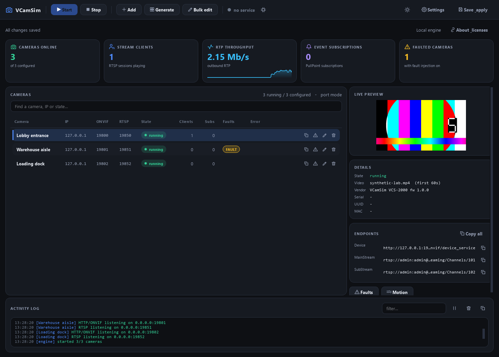

# VCamSim — Virtual ONVIF Camera Simulator

**Turn your own video files into virtual IP cameras.** Choose a video from your
computer and VCamSim loops it as an H.264 or H.265 RTSP stream that a video
management system can connect to like a camera. Test ONVIF integration and
simulate network, authentication, video and event failures without a rack of
physical devices.



## Quick start

Use Python 3.11 or newer. Windows is the primary desktop platform.

```powershell
python -m venv .venv
.venv\Scripts\Activate.ps1
python -m pip install -r requirements.txt
python run_gui.py
```

Install **FFmpeg and ffprobe separately**, with `libx264` and `libx265` support.
Put them on PATH, beside the application, or in its `ffmpeg/bin` directory.
See [FFmpeg's download page](https://ffmpeg.org/download.html) and check the
license of the build you select. No FFmpeg binaries are included here.

### Use your own video file

1. Click **Generate cameras** on the welcome screen, or **Generate** in the
   toolbar.
2. Next to **Video file**, click **Browse** and select a video on your computer.
   The picker includes MP4, MKV, AVI, MOV and TS files; decoding depends on your
   installed FFmpeg build and the codecs inside the file.
3. Choose the camera **Count** and output **Codec** (H264 or H265).
   **Import only first** defaults to 60 seconds; set it to **0 (whole file)**
   to use the entire video.
4. Click **Generate**, then **Start**. VCamSim imports the source once and loops
   it continuously. Connect your VMS or RTSP client to a generated camera.

One video can feed many cameras. For **different videos on different cameras**,
use **Add** to create a camera with its own video, or **Edit** an existing camera
and choose another **Video file**. **Bulk edit** can change the source video for
multiple selected cameras. No sample video is bundled; supply your own file.

Use **Save & apply** to persist edits and restart a running engine with the
new configuration. Later starts reuse the imported media cache. Fault toggles
apply immediately. Closing the GUI stops its local engine; a separately running
Windows service continues serving cameras.

## Features

- **Bring your own video:** browse for a local file and loop it as a camera feed;
  share one video across many cameras or choose a different source per camera.
- ONVIF Device, Media, Media2, Events and Imaging operations; WS-Discovery.
- RTSP over TCP or UDP; H.264/H.265 RTP; JPEG snapshots; PullPoint events.
- Main and sub streams; shared cached media and a continuous camera timeline.
- Searchable camera table, bulk editing, dark/light themes and live preview.
- Live fault injection: offline, authentication failure, clock drift, delayed
  SOAP, dropped packets, frozen video, event flooding and more.
- Optional Windows service controlled through a token-authenticated loopback API.

This is a simulator with a partial ONVIF implementation, not an ONVIF-certified
device. There is no audio or PTZ. Some device-setting operations are simulated.
Snapshots are extracted at one frame per second.

## Command line

Replace the example video path with the file you want to use. Quote paths that
contain spaces. This example creates four cameras using the same video:

```powershell
python -m vcamsim -c config.yaml gen --video "C:\videos\sample.mp4" --count 4
python -m vcamsim -c config.yaml run
python -m vcamsim -c config.yaml list
```

In default port mode, camera 1 exposes:

```text
http://<your-ip>:8000/onvif/device_service
http://<your-ip>:8000/onvif/media_service
http://<your-ip>:8000/onvif/media2_service
http://<your-ip>:8000/onvif/event_service
rtsp://<your-ip>:554/Streaming/Channels/101
rtsp://<your-ip>:554/Streaming/Channels/102
```

The next camera uses ports 8001 and 555. Alias mode uses a separate IP per
camera and requires Administrator rights on Windows. Use an unused IP range.
Only aliases successfully created by this run are removed at shutdown.

Default lab credentials are `admin` / `admin`; change them in the camera
dialog. Run on a trusted test network: ONVIF HTTP, RTSP and the control channel
do not provide TLS. Windows Firewall may need an inbound rule for remote VMS
clients. The **service menu → Windows Firewall** action manages the GUI rule;
service deployments also need a rule for the service executable.

## Configuration and local data

`config.example.yaml` is a reference, not an automatically loaded camera.
The GUI creates `config.yaml` when you save. Relative media and configuration
paths resolve against the application directory. A source checkout must be
writable for its configuration and cache.

Keep `config.yaml`, `control.token`, source videos, media caches, logs and
screenshots containing real environments private. Git ignores them. The
source export tool also uses an explicit file list instead of zipping the
whole working directory.

## Development

```powershell
python -m pip install -r requirements-dev.txt
python -m pytest -q
python -m ruff check vcamsim tests tools
python tools/smoke_test.py
python tools/edge_test.py
python tools/gui_test.py
python tools/service_test.py
python tools/scale_test.py 30 10 H264
python tools/scale_test.py 4 3 H265
```

`requirements-tested.txt` records the Windows dependency versions used for the
current validation. The broader requirements allow compatible updates.

Run the GUI suite on its own. Integration suites use separate high ports and
synthetic clips; discovery tests also exercise multicast. They do not require
installing a Windows service. On a shared machine, run from a disposable copy
and verify the test ports are free.

See [architecture](docs/architecture.md), [building and publishing](docs/release.md),
[security](SECURITY.md), and [third-party notices](THIRD_PARTY_NOTICES.md).

## License

Original VCamSim code is MIT licensed. Third-party terms remain applicable;
see [LICENSE](LICENSE) and [THIRD_PARTY_NOTICES.md](THIRD_PARTY_NOTICES.md).
